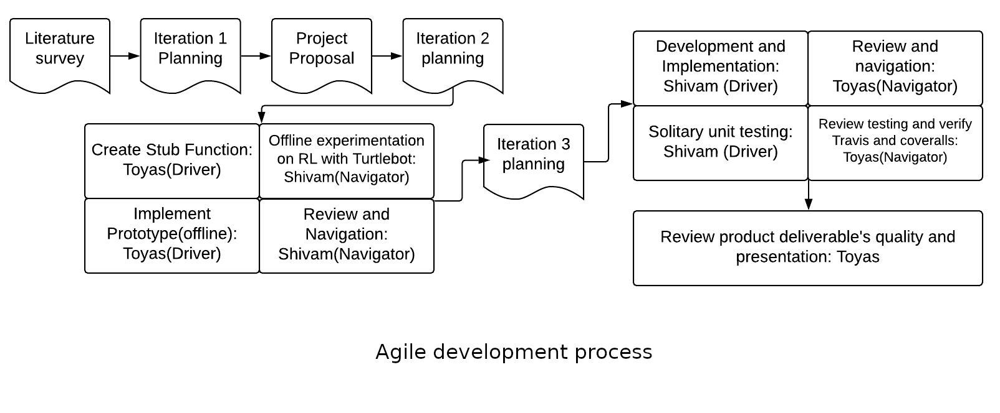

[](https://github.com/ToyasDhake/project_hecate/blob/master/License) [](https://travis-ci.org/ToyasDhake/project_hecate) [](https://coveralls.io/github/ToyasDhake/project_hecate?branch=master)


# Project Hecate

Table Contents:
- [Overview](#overview)
- [Main Features](#main)
- [System Design and Algorithm](#system) 
- [Demo Steps](#demo)
- [Dependencies](#depend)
- [Results](#results)
- [Assumptions](#assume)
- [Known Issues and Limitations](#limits)
- [Developer Documentation](#docs)
- [Agile Development Process Details](#agile)
- [Product Backlog and Sprint sheet](#d)
- [License](#license)
- [Contributors](#contributors)

## <a name="overview"></a> Overview 

We propose a self-navigating package delivery robot, capable of finding route between logistic stations and deliver mobile parts like electric circuits, motherboards, screens and similar embedded parts from the manufacturing unit to the assembly line, in large factory units, like the Apple’s factory in China. Such autonomous robotic system with inherent artificial intelligence to find it’s way in factories and avoid collisions while traversing, has been developed to yield big returns to Acme robotics.

## <a name="main"></a> Main features of the product


- Capable of ‘learning to find it’s way’ in a factory/random environment

- Obstacle avoidance

- Spawns at its default location (origin in the gazebo world) and when user commands to deliver a package, it moves to Point A to collect the package. It waits for the factory worker to put the package on it for 5 seconds and then moves towards the Point B, to deliver the package.

- Autonomous navigation

## <a name="system"></a> System Design and Algorithm


The architecture involves a turtlebot which has laserscan  and odometry to receive the "state" of its environment and actuator control system which allows the turtlebot to take three actions, including move straight , turn right and turn left. 


The algorithm implemented is called reinforcement learning (RL).
RL is an aspect of Machine learning where an agent learns to behave in an environment, by performing certain actions and observing the rewards/results which it gets from those actions. It’s important to note that while RL at its core aims to maximize rewards/gains, implementing a greedy approach, doesn’t always lead to successful learning.


## <a name="demo"></a> Demo Steps

The complete demonstrations steps have been added [here](https://youtu.be/ehMnWviiR5o)

### Build Steps
```
cd mkdir -p ~/catkin_ws/src
cd ~/catkin_ws/
catkin_make
cd src
git clone https://github.com/ToyasDhake/project_hecate.git
cd ..
catkin_make
```

### Demo Steps

The user has to specify two points in the gazebo world-
1. Point A- This is the point the turtleboit navigates to, from the origin resting place,in order to receive the load package from the factory worker. The turtlebot waits for the factory worker for about 5 seconds to put on the load. (syntax: xInitial:= X Coordinate of Point A  yInitial:= Y Coordinate of Point A)
2. Point B- This is the point the turtlebot navigates to, after picking up the load from Point A, to drop the load at Point B.
(syntax: xFinal:= X Coordinate of Point B  yFinal:= Y Coordinate of Point B
For example, in the commands below, Point A coordinates is (2,2) and Point B coordinates is (0,7). With our experiments we found that this is one of the tough combinations for the RL to predict trajectory of the turtlebot, but our results are pretty good even on these points.

```
source devel/setup.bash
#To load Default RL trained model
roslaunch project_hecate testHecate.launch xInitial:=2 yInitial:=2 xFinal:=0 yFinal:=7

# To train a custom model
roslaunch project_hecate trainHecate.launch path:=<path_to_save>
Note : <path_to_save> should be an absolute path. For example: 
"/home/shivam/catkin_ws/src/project_hecate/model.csv"

#To load custom RL model trained by the user
roslaunch project_hecate testHecate.launch xInitial:=2 yInitial:=2 xFinal:=0 yFinal:=7 path:=<path_to_table>
```

### Test Steps
```
cd ~/catkin_ws/
catkin_make run_tests
```

### Doxygen Steps
```
sudo apt install doxygen
cd <project_hecate repo>
doxygen -g
doxygen
cd latex
make
## Creates a pdf containing doxygen documentation. The same can be found in the repository under the Documentation folder.
```
### Rosbag record and Play

To record:
```
cd ~/catkin_ws/
source devel/setup.bash
roslaunch project_hecate testHecate.launch xInitial:=2 yInitial:=2 xFinal:=0 yFinal:=7 rosbagEnable:=true
```
To play:
Download the rosbag from the [link](https://drive.google.com/open?id=1mX1fIqaXv8HXWAwkDrOgJz17dvpblmXe)
and place it in the results folder of this repository
```
Terminal 1:
roscore

Terminal2:
cd ~/catkin_ws/src/project_hecate/results
rosbag play hecate.bag
```


## <a name="depend"></a> Dependencies
ROS Kinetic

TurtleBot v2

ROS Kinetic

Gazebo 7.4 and above

Catkin


## <a name="results"></a> Results
The following gif shows the training of the turtlebot to "learn its way" through a floor map. During training as shown below, the turtlebot starts from the origin and then tries to navigate by taking actions of - going straight, take a left or take a right, in each episode. For each of these three actions, the turtlebot receives a reward. An episode involves a set of actions till the turtlebot collides. The episode ends after collision. The priciple during training is to achieve maximum sum of rewards in an episode. With more epochs of training, the turtlebot tries to maximize its rewards in the episode and stores the actions it took for the given states, which led to it earning maximum episode rewards.


During Inference, the turtlebot uses its learnt knowledge during training to decide on what actions to take, given a state, which had earlier fetched it maximum rewards during training. This is illustrated in the gif below, where the turtlebot is given Point A= (2,2) and Point B= (0,7). When the turtlebot starts from the origin to move towards (2,2), it attains maximum rewards for taking the action of turning slightly right towards (2,2) and then move straight towards it. Upon reaching point B, the turtlebot waits for the factory worker to place the weigth on the turtlebot. Again, when the turtlebot starts moving towards (0,7), for each small movement, the turtlebot looks inside the trained model to understand what action it should take based on what action earned it maximum reward when it was in similar state during training. Accordingly, the turtlebot finds it's way to the desired point B.


## <a name="assume"></a> Assumptions: 
1. We assume that the gazebo world is not changed drastically. Although the RL algorithm is capable of performing well in a dynamic world it was not trained on, drastic changes may require hyperparameter tuning of the algorithm.
2. We train the model on the gazebo simulator and assume that it performs well on real world too.
3. Acme Robotics has powerful systems with Ubuntu 16 and Ros kinetics with Gazebo (I7 processor, 16 GB RAM).
4. We assume that the obstacles are stationary.

## <a name="limit"></a> Known Issues and Limitations
1. The RL algorithm is under active research. The algorithm implemented navigates the robot autonomously and collision free from point A to Point B, but ocassionally the path taken is not highly optimized. 
2. The training of the turtlebot is highly compute intensive.
3. The Reinforcement learning algorithm was developed with hyperparametrs optimized for the gazebo world used in the simulation. New worlds may requires training the RL world with hyperparameter tuning and modifications.
4. The user has to define the Point A and Point B within the rectangular walls of the gazebo world. If not done so, the turtlebot would go towards the wall to reach the point, then avoid it and go back again and repeat in a loop.
5 The Cpplint forbids the use of "non-const reference". But passing "const" to ROS function callbacks is not allowed.  


## <a name="docs"></a> Developer Documentation
1. To train the model on a new gazebo world, tune the hyperparamers like the epsilon value, rewards. The developer might have to experiment with the linear and angular velocities for the robot to move take actions slower for the Rl states for better training.
2. Train the model with good number of epochs.
3. Create the gazebo environment as a single model instead of agreegating seprate models and building the environment. This is because when we call reset Environment in the training pipeline, the orientation of objects resets to (0,0,0).

## <a name="agile"></a> Agile Development Process details 


We followed the Pair Programming development procedure which started with both the contributors doing an extensive literature survey. After agreement on the algorithm and the approach, we moved ahead with the first level iteration planning. The week one of the project involved development of stub functions, which was Toyas (driver) while Shivam (navigator) was involved in planning and sanity check as well as a prototype development for the complete product as a proof of concept. 
The week 2 was started with the review of the potential risks and the remaining backlogs. We switched the roles, and the current driver implemented the Reinforcement learning algorithm, while the navigator did the review and to ensure quality of the product delivery. This development, implementation and testing was continued in the Iteration 3 of the project.


## <a name="d"></a> Documentation

### Product Backlog and Sprint Schedule
The product backlog file can be accessed [here](https://docs.google.com/spreadsheets/d/1CMIzxtqc-AxdCg9Mqs4tmX4eBPp3Yyy5vdFZ9n3fnpU/edit?usp=sharing)

The Sprint planning and review document can be accessed [here](https://docs.google.com/document/d/1bXLFW7gJ9vdtRvNPkyLKW2za1OYg1eaJVJBhiPVOmLE/edit?usp=sharing)

The presentation slides is available [here](https://docs.google.com/presentation/d/1U1F3XCiZAi0NFDbWznxIb-vIipTF5iEBj4lEAkPtH4Y/edit?usp=sharing)

Video Presentation [here](https://youtu.be/tMpWSQOfUvs)


## <a name="license"></a> License

Copyright (C) 2019 Shivam Akhauri, Toyas Dhake.

For license information, see [LICENSE](License).

```
/**
BSD 3-Clause License

Copyright (c) 2019, Shivam Akhauri,Toyas Dhake
All rights reserved.

Redistribution and use in source and binary forms, with or without
modification, are permitted provided that the following conditions are met:

1. Redistributions of source code must retain the above copyright notice, this
   list of conditions and the following disclaimer.

2. Redistributions in binary form must reproduce the above copyright notice,
   this list of conditions and the following disclaimer in the documentation
   and/or other materials provided with the distribution.

3. Neither the name of the copyright holder nor the names of its
   contributors may be used to endorse or promote products derived from
   this software without specific prior written permission.

THIS SOFTWARE IS PROVIDED BY THE COPYRIGHT HOLDERS AND CONTRIBUTORS "AS IS"
AND ANY EXPRESS OR IMPLIED WARRANTIES, INCLUDING, BUT NOT LIMITED TO, THE
IMPLIED WARRANTIES OF MERCHANTABILITY AND FITNESS FOR A PARTICULAR PURPOSE ARE
DISCLAIMED. IN NO EVENT SHALL THE COPYRIGHT HOLDER OR CONTRIBUTORS BE LIABLE
FOR ANY DIRECT, INDIRECT, INCIDENTAL, SPECIAL, EXEMPLARY, OR CONSEQUENTIAL
DAMAGES (INCLUDING, BUT NOT LIMITED TO, PROCUREMENT OF SUBSTITUTE GOODS OR
SERVICES; LOSS OF USE, DATA, OR PROFITS; OR BUSINESS INTERRUPTION) HOWEVER
CAUSED AND ON ANY THEORY OF LIABILITY, WHETHER IN CONTRACT, STRICT LIABILITY,
OR TORT (INCLUDING NEGLIGENCE OR OTHERWISE) ARISING IN ANY WAY OUT OF THE USE
OF THIS SOFTWARE, EVEN IF ADVISED OF THE POSSIBILITY OF SUCH DAMAGE.
**/
```
## <a name="contributors"></a> Contributors

### Shivam Akhauri 

Former Artificial Intelligence Engineer at Ether Labs. -Former Machine learning Engineer and Project Lead at Tata Elxsi. -Skilled in AI/ML with applications in Computer vision, NLP and Robotics.


### Toyas Dhake

Robotics engineer, University of Maryland College Park. -Skilled in embedded system with applications involving Arduino, Raspberry Pi and Jetson Boards.

